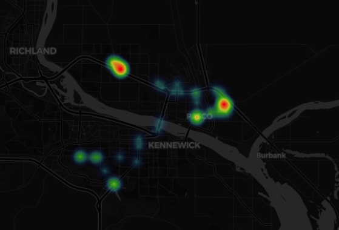

# life360-influx

Allows for importing data from [Life360](https://www.life360.com/) to [InfluxDB](https://www.influxdata.com/) v2.


## Requirements

- [Life360](https://www.life360.com/) credentials associated with an active circle.
- A device with either [Docker](https://www.docker.com/) or Python 3.11+ installed.
- [InfluxDB](https://en.wikipedia.org/wiki/InfluxDB) v2 installed on this device or another device, and a bucket created in influxDB.

## Setup

The app reads the settings from `template.config.toml`, then `config.toml`` (if it exists), then environment variables.
See `template.config.toml` for details.

### With Docker & config file

Dependency: Docker installed.

1. Download and run the Docker image: `sudo docker run --name life360 -v config.toml:/app/config.toml vdbg/life360-influx:latest`
2. Copy the template config file from the image: `sudo docker cp life360:/app/template.config.toml config.toml`
3. Edit `config.toml` by following the instructions in the file
4. Start the container again to verify the settings are correct: `sudo docker start life360 -i -e LIFE360_INFLUX_LOG_VERBOSITY=DEBUG`
5. Once the settings are finalized, `Ctrl-C` to stop the container, `sudo docker container rm life360` to delete it
6. Start the container with the final settings:

```
sudo docker run \
  -d \
  --name life360 \
  -v /path_to_your/config.toml:/app/config.toml \
  --memory=100m \
  --pull=always \
  --restart=always \
  vdbg/life360-influx:latest
```

### With Docker without config file

Dependency: Docker installed.

Inspect `template.config.toml` file for all the settings that need to be overriden. Command will look something like:

```
sudo docker run \
  -d \
  --name life360 \
  --memory=100m \
  --pull=always \
  --restart=always \
  -e LIFE360_INFLUX_LIFE360_USERNAME=user \
  -e LIFE360_INFLUX_LIFE360_PASSWORD=password \
  -e LIFE360_INFLUX_INFLUX_TOKEN=token \
  vdbg/life360-influx:latest
```

### Without Docker

Dependency: Python 3.11+ and pip3 installed. `sudo apt-get install python3-pip` if missing on raspbian.

1. Git clone this repository and cd into directory
2. `cp template.config.toml config.toml`
3. Edit file `config.toml` by following the instructions in the file
4. `pip3 install -r requirements.txt`
5. `python3 main.py` or `./main.py`

## Grafana


To get a dashboard similar to the below one, download the [template](grafana/dashboard.json), and replace these placeholders before creating a dashboard from the template:
* `Name_Of_Circle`: name of the Life360 circle of interest, e.g. `Family`,
* `Member_1` to `Member_4`: names of the circle members of interest. Delete extra panels if fewer than 4 members, duplicate one if more.



## Known issues

Sometimes, Life360 updates the access token that's used in life360/auth_token of config.toml.
When that happens, requests will fail with `403 Client Error: Forbidden for url: https://api.life360.com/v3/oauth2/token.json`.

Fix is to update this app/docker container (if available) or google the old access token (hoping one of the hits will provide the new one)